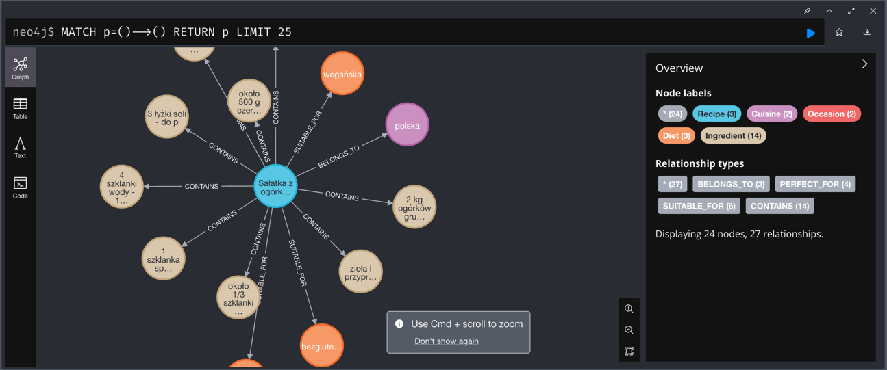

**Wzór**

<strong>Proponowana struktura dokumentacji końcowej projektu</strong>

1. Wprowadzenie

  Krótki opis problemu biznesowego (np. skalowalne dopasowanie talentów do projektów).

  Wizja systemu Talent Match AI.

  Krótkie podsumowanie zastosowanych technologii (Neo4j, LangChain, MCP, LangSmith).

2. Opis architektury systemu

  Schemat architektury (graf przepływu danych i komponentów).

   Źródła danych.

  Opis poszczególnych modułów:

    Ingestion (CV PDF -> knowledge graph)

    RFP Parsing & Availability

    Matching Engine

    Conversation Agent (schmat grafu, jeśli został zaprojektowany, lista i opis tooli)

    Frontend Layer

3. Knowledge Graph

  Schemat grafu (encje i relacje).

  Jak przetwarzano dane wejściowe: CV, RFP, pliki YAML/JSON.

  Metody walidacji danych i zapewnienia jakości ekstrakcji.

4. Algorytm dopasowania danych z różnych źródeł (Matching Algorithm)

  Jak działa algorytm dopasowania – krok po kroku.

  Jak uwzględnia różne czynniki: skills match, doświadczenie, dostępność.

  Wyjaśnienie sposobu punktacji / rankingowania kandydatów.

  Na przykład: łączenie po podobieństwie embeddingów, LLM-as-a-Judge, Advanced RAG + scoring, HybridRAG, własna metryka do scoringu, itp.

5. Business Intelligence / Zaawansowane zapytania

  Lista obsługiwanych typów zapytań, np.: Liczenie Filtrowanie Agregacja Reasoning / multi-hop Zapytania czasowe Złożone scenariusze biznesowe (co-jeśli, optymalizacja zespołu)

  Przykłady zapytań i odpowiedzi systemu.

6. Wyniki eksperymentów / metryki

  Dokładność dopasowania (matching accuracy)

  Czas odpowiedzi na zapytania.

  Efektywność grafu (średni czas przeszukiwania Cypher).

  Porównanie GraphRAG vs. tradycyjny RAG:

    Porównanie wydajności

    Dokładność odpowiedzi na złożone zapytania

    Czas odpowiedzi

    Wybrane metryki

7. Wnioski i rekomendacje

  Co działało najlepiej w systemie GraphRAG?

  Gdzie tradycyjny RAG był niewystarczający?

  Ewentualne ograniczenia i kierunki rozwoju (dynamiczne RFP, real-time updates)?

  Czego nie udało się zrobić?

  Jakie system ma ograniczenia?

8. Załączniki / dokumentacja techniczna

  Link do repozytorium (jeśli jest publiczne)

  Instrukcje uruchomienia systemu (Docker, Neo4j, środowisko Python).
 

<strong>Dokumentacja projektu na TEG - zaoczne 2025</strong>

1. Wprowadzenie
 <strong>Problem biznesowy</strong>: Agent asystujący przy planowaniu posiłków. 
Ma wyszukiwać przepisy na podstawie tego co użytknownik ma w lodówce, 
tworzyć listy zakupów na podstawie przepisów, które użytkownik chce wykonać.
 <strong>Użyte technolgie</strong>: Neo4j, 
Langchain, Tavily, Azure Cognitive Services
2. Opis modułów
 **Przechowywanie danych**:
Dane *lodówki* i *listy zakupów* przechowywane są lokalnie w 
folderze: **data** w formacie `json`. 
Zarządzanie nimi(*odczyt, zapis, dodawanie, usuwanie*) odbywa się za pomocą klasy 
`ListBlueprint`, która jest implementowana jest odpowiednio przez przez klasy: `Fridge` i `ShoppingList`.
 **Odczyt danych z pisma ręcznego**:
System pozwala na odczyt danych z pisma ręcznego. 
Zajmuje się tym klasa: `PhotoReader`. Zdjęcie jest odczytywane w postaci *bajtów*, 
następnie jest analizowane przez `ImageAnalysisClient`. 
Dane odczytane przez klienta zostają odpowiednio 
przetworzone przez llm (w tym projekcie użyto:
**gpt-5-nano**), oraz zwrócone jako `json`.
 **Zaciąganie danych ze strony AniaGotuje**: 
Dane ze strony aniagotuje.pl są zaciągane 
za pomocą **scrapera**`AniaGotujeSpider`(startując z url: 
*https://api.aniagotuje.pl/client/posts/search?perPage=200&page=0&sort=publish,desc*)
i dodawane w ustrukturyzowanej formie za pomocą `RecipeDataPipeline`.
 **Agent**: Za zarządzanie systemem i przetwarzanie zapytań użytkownika 
odpowiada **Agent(`FridgeChatbot`)**, znajdujący się 
w pliku **chatbot_with_tools.py**. najdują się tam wszystkie prompty, 
konfiguracje **RAG** i **Graph RAG**, oraz **toole**.
 **Front**: Front został wykonany w **streamlit** i 
znajduje się w pliku **app.py**. Jest prosty i czytelny, na samym początku użytkownika
wida pole tekstowe zachęcające do rozpoczęcia integracji z asystentem, po prawej stronie
widoczne jest podsumowanie co użytkownik ma odpowiednio w *Lodówce* i na *Liście zakupów*, a
z prawej znajduje się lista wyboru widoku: *Chatbot*, *Lodówka*, *Lista zakupów*, oraz
lista z wyborem opcji. Wybranie opcji *Neo4j* pozwala na dalszy wybór: *RAG*,
albo *Graph RAG*.
 **Toole**:
- `read_fridge` -> Zwraca listę składaników z lodówki
- `add_ingredient_to_fridge` -> Dodaje nowy składnik do 
listy składników w lodówce
- `remove_ingredient_from_fridge` -> Usuwa składnik z
listy składników w lodówce
- `add_ingredient_to_shopping_list` -> Dodaje nowy składnik do 
listy zakupów
- `add_missing_ingredients_for_recipe` -> Dodaje do listy
zakupów produkty potrzebne do wykonania przepisu, których
nie ma w lodówce. Używany, gdy użytkownik wyraźnie o to 
poprosi
3. Knowledge Graph
 **Przykładowy fragment grafu**:
Każdy **przepis** ma relację: *CONTAINS* 
ze składnikami, które go tworzą, *BELONGS_TO* z rodzajem
kuchni do której należy(np. polska, włoska itp),
*SUITABLE_FOR* dla rodzaju diety (np. bezglutenowa).
Pozwala to na dokładne wyszukiwanie przepisów w zależnosći
od preferencji użytkownika i od składników, które ma,
bądź chce użyć.
4. Zaawansowane zapytania
5. Metryki
6. Wnioski i rekomendacje
7. Załączniki
 **Konfiguracja:**
 
   1. Wszystkie potrzebne paczki znajdują się w pliku: **requirements.txt**, 
   należy je pobrać.
   2. Stworzyć kontener z **neo4j**
      1. Pobrać obraz **neo4j**
      2. Wywołać komendę:  `docker run \
    -p 7474:7474 -p 7687:7687 \
    -v $PWD/data:/data -v $PWD/plugins:/plugins \
    --name neo4j-apoc \
    -e NEO4J_apoc_export_file_enabled=true \
    -e NEO4J_apoc_import_file_enabled=true \
    -e NEO4J_apoc_import_file_use__neo4j__config=true \
    -e NEO4JLABS_PLUGINS=\[\"apoc\"\] \
    neo4j`
   3. Wywołać komendę: `.venv/bin/activate `, 
   żeby aktywować środowisko wirtualne
   4. Przygotować plik: **.env**, 
   żeby posiadał następujące dane:
    `AZURE_OPENAI_ENDPOINT="https://s20519.openai.azure.com/openai/deployments/gpt-4o-mini/chat/completions?api-version=2025-01-01-preview"
AZURE_OPENAI_API_KEY=""
OPENAI_API_VERSION="2025-01-01-preview"
TAVILY_API_KEY=""
COGNITIVE_API="https://fridgepoc.cognitiveservices.azure.com/"
COGNITIVE_KEY=""
NEO4J_PASSWORD=""` (*klucze i hasło do **neo4j** należy wypełnić swoimi danymi*)
   5. Urchomić scraper komendą: `scrapy crawl aniagotuje_spider`
   6. Uruchomić aplikację komendą: `streamlit run app.py `